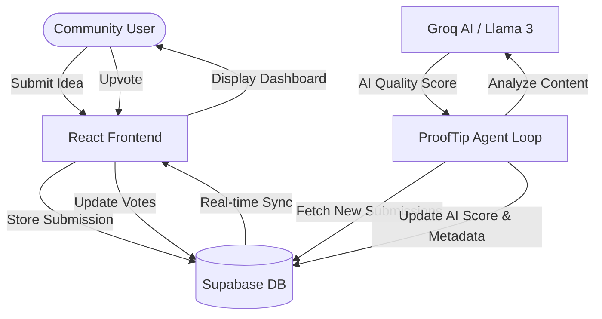

# 🛡️ ProofTip: AI-Powered Reward Agent

**ProofTip** is a decentralized community contribution platform that leverages AI to automatically evaluate and reward high-quality submissions. Built for hackathons and community governance, it ensures that great ideas get the recognition (and rewards) they deserve without manual overhead.

---

## 🌟 Key Features

- **🚀 Instant Submissions**: Users can easily submit their ideas, projects, or contributions with a wallet address for rewards.
- **🗳️ Community-Driven**: Upvote system lets the community highlight the most promising submissions.
- **🤖 Autonomous AI Agent**: A background agent periodically fetches new submissions and uses LLMs (via Groq) to provide objective quality scores (0-100).
- **💰 Automated Rewards**: Built-in logic to trigger rewards based on community upvotes, mentor approval, and AI evaluation.
- **💎 Premium UI**: A sleek, dark-mode dashboard with glassmorphism effects and real-time feedback.

---

## 🏗️ Architecture

ProofTip follows a modern, serverless architecture that bridges the gap between community interaction and automated AI governance.



### Component Breakdown
- **Frontend**: React 18, Vite, TypeScript, and Tailwind CSS for a high-performance, type-safe user experience.
- **Database**: Supabase (PostgreSQL) handles real-time data storage and Row-Level Security (RLS).
- **AI Engine**: Groq API provides near-instant inference using Llama 3 / Mixtral models for evaluation.
- **Agent Loop**: A dedicated agent (`rewardAgent.ts`) that runs within the application lifecycle to manage autonomous tasks.

---

## 🛠️ Tech Stack

| Layer | Technology |
| :--- | :--- |
| **Framework** | [React 18](https://reactjs.org/) + [Vite](https://vitejs.dev/) |
| **Language** | [TypeScript](https://www.typescriptlang.org/) |
| **Styling** | [Tailwind CSS](https://tailwindcss.com/) |
| **Backend** | [Supabase](https://supabase.com/) |
| **AI API** | [Groq](https://groq.com/) (Llama-3-70b/8b) |
| **Icons** | [Lucide React](https://lucide.dev/) |
| **Notifications** | [React Hot Toast](https://react-hot-toast.com/) |

---

## 🚀 Getting Started

### 1. Prerequisites
- Node.js (v18+)
- A Supabase project
- A Groq API key

### 2. Configure Environment
Create a `.env` file in the root directory:
```env
VITE_SUPABASE_URL=your_supabase_url
VITE_SUPABASE_ANON_KEY=your_supabase_anon_key
VITE_GROQ_API_KEY=your_groq_api_key
```

### 3. Database Setup
Run the SQL script found in `supabase/schema.sql` in your Supabase SQL Editor to create the necessary tables and RLS policies.

### 4. Install & Run
```bash
# Install dependencies
npm install

# Start development server
npm run dev
```

---

## 🛡️ License
Distributed under the MIT License. See `LICENSE` for more information.

---
*Built with ❤️ for the decentralized future.*
